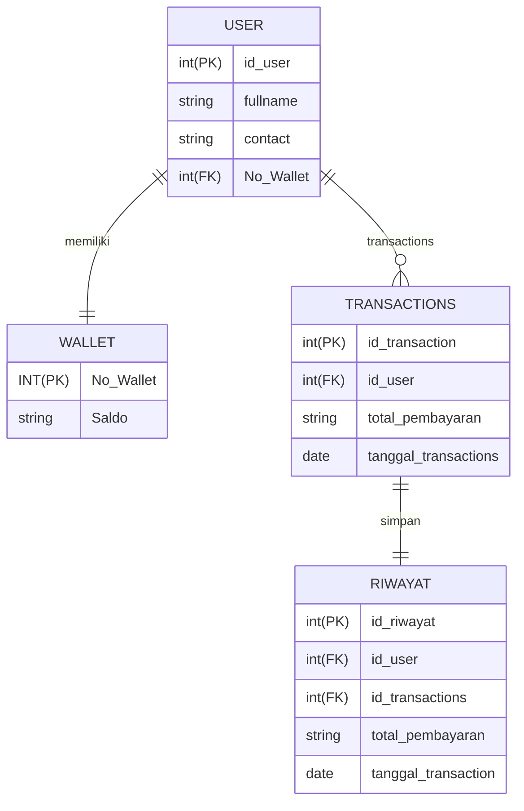

## ERD E-wallet

```mermaid
erDiagram
    USER ||--|| WALLET : memiliki
    USER || --o{ TRANSACTIONS : transactions
    TRANSACTIONS ||--|| RIWAYAT : simpan
    USER {
        int(PK) id_user
        string fullname
        string contact
        int(FK) No_Wallet
    }
    WALLET{
        INT(PK) No_Wallet
        string Saldo
    }
    TRANSACTIONS{
        int(PK) id_transaction
        int(FK) id_user
        string total_pembayaran
        date tanggal_transactions
    }
    RIWAYAT{
        int(PK) id_riwayat
        int(FK) id_user
        int(FK) id_transactions
        string total_pembayaran
        date tanggal_transaction
    }
```
